## Создание компонента

### Поиск документации

1. Найти нужный компонент на сайте производителя (в примере - конденсатор от _Samsung Electro-Mechanics_) и открыть документацию (т.е. _datasheet_). В данном случае это иконка _Spec_

2. Найти в документации размеры компонента и его характеристики, последние понадобятся для заполнения _Excel_-таблицы библиотеки

### Создание условного графического обозначения (УГО)

1. Найти стандарт на УГО выбранного компонента (на конденсаторы - ГОСТ 2.728-74)

2. Выбрать УГО для своего компонента (для выбранного керамического неполярного конденсатора - обычное, первое)

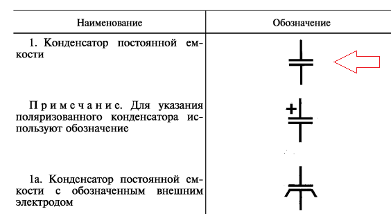

3. Здесь же ниже найти размеры для выбранного УГО

4. В _Altium_ создать файл для схемы, пройдя по _File -> New -> Library -> Schematic Library_

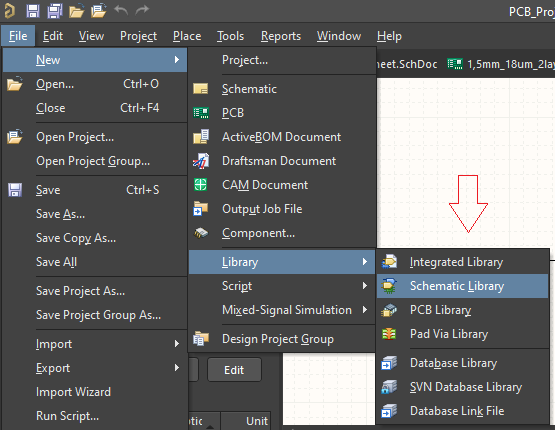

5. Нарисовать УГО компонента в соответствии с ГОСТ, при этом:
    1. Настройки выводов открываются горячей клавишей _F11_ при их выборе
    2. Выводы рисуются с помощью _Pin_ длиной 5 мм
    3. Выводы имеют _Name_ и _Designator_, начиная с 1 (убедиться в этом и не забыть погасить их отображение в настройках, т.к. для пассивных компонентов это излишне)
    4. Корпус рисуется с помощью _Line_
    5. Шаг сетки можно задать в настройках (_Shematic - > Grids -> Metric Grid Presets_), а переключать - горячей клавишей _G_
    
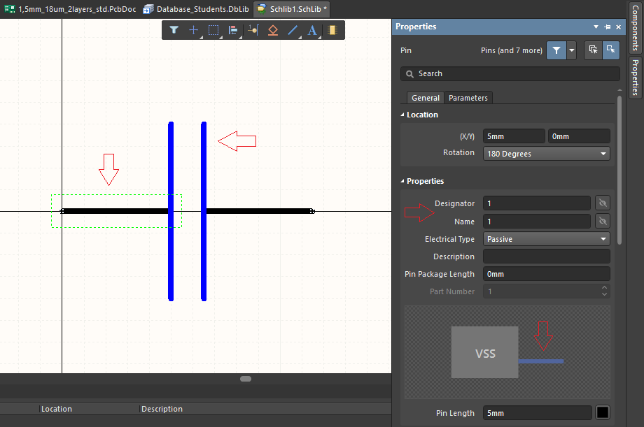

6. Перейти в настройки всего компонента, щелкнув по любой части схемы вне его и нажав _F11_. Заполнить поля _Design Item ID_, _Designator_, _Comment_ и _Description_ следующим образом
    1. _Design Item ID_ - начинается с позиционного обозначения (для конденсатора - С), затем дефис и надпись, какая именно - вопрос открыт. Лучше всего примерно в таком виде - _C-50.0V_, где _50.0V_ - это номинальное напряжение данного конденсатора
    2. _Designator_ - позиционное обозначение конденсатора со знаком вопроса, который на схеме _Altium_ почти автоматически сам изменит на цифру
    3. _Comment_ - в данном случае мы вписываем сюда значение поля "Номинал" для этого компонента из _Excel_-файла библиотеки
    4. _Description_ - вписываем сюда значение поля "Описание" для этого компонента из _Excel_-файла библиотеки

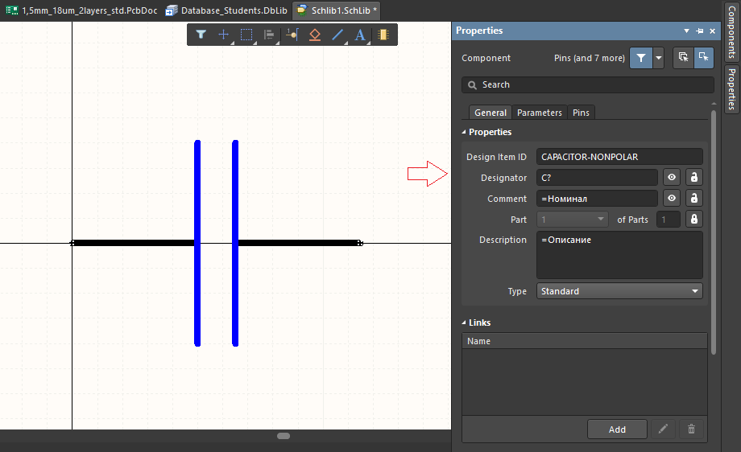

7. Сохраняем файл со схемой в папку _sch_ библиотеки, называя его по аналогии с _Design Item ID_, прописывая вместо позиционного обозначения полное название. Например, _C-50.0V_ преобразуется в _capacitor_50.0v_

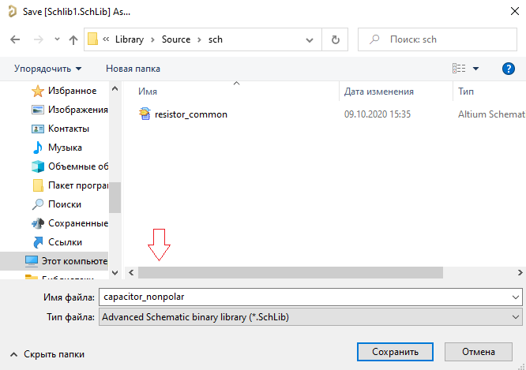

### Создание посадочного места (т.е. _footprint_)

1. В _Altium_ создать файл для посадочного места, пройдя по _File -> New -> Library -> PCB Library_. Затем открыть инструмент для создания посадочного места в соответствии со стандартами _IPC_, нажав _Tools -> IPC Compliant Footprint Wizard_

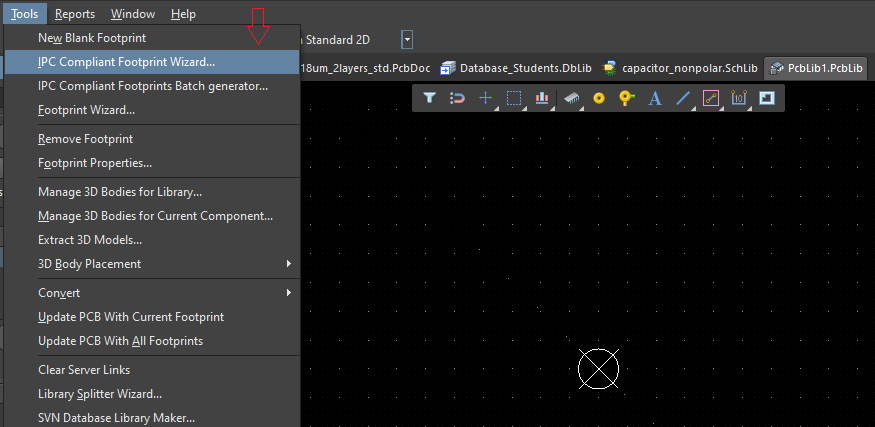

2. Выбрать вариант корпуса своего компонента (в данном случае - _CHIP_)

3. В поле _Package Type_ выбрать нужный компонент. В поле _Polarity Pin Location_ данному конденсатору соответствует пункт _None_. Остальные поля с размерами заполняются согласно документации

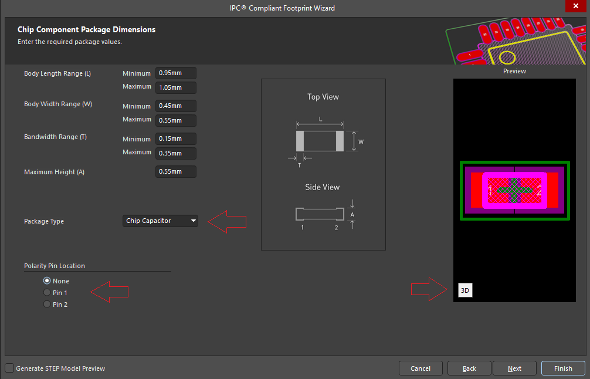

4. Далее нажимать _Next_, не меняя настроек, до появления следующего окна. Проверить толщину линии шелкографии в поле _Silkscreen Line Width_, значение должно быть 0,2 мм

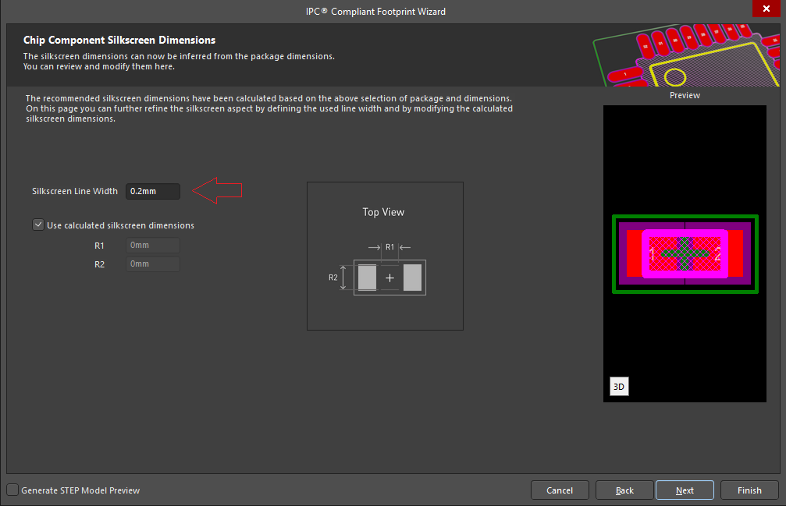

5. Далее нажимать _Next_, не меняя настроек, до появления следующего окна. Проверить пункты
    1. _Add Courtyard Information (Зона запрещения) - толщина линии 0,05 мм, расположение на слое _Mechanical Layer 15_
    2. _Add Assembly Information (Контур корпуса) - толщина линии 0,1 мм, расположение на слое _Mechanical Layer 11_
    3. _Add Component Body Information (3D-модель) - расположение на слое _Mechanical Layer 13_

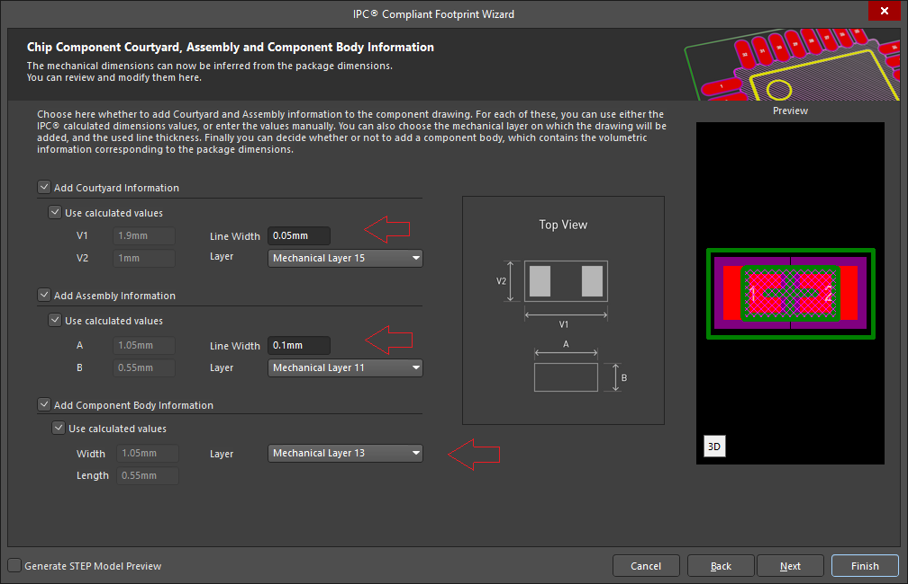

6. Далее нажимать _Next_, не меняя настроек, до появления следующего окна. Выбрать пункт _Use suggested values_ для заполнения полей по умолчанию, затем отключить и исправить значение в поле _Name_ на позиционное обозначение и тип корпуса (однако и тут вопрос остается открытым). В данном случае - _C0402_

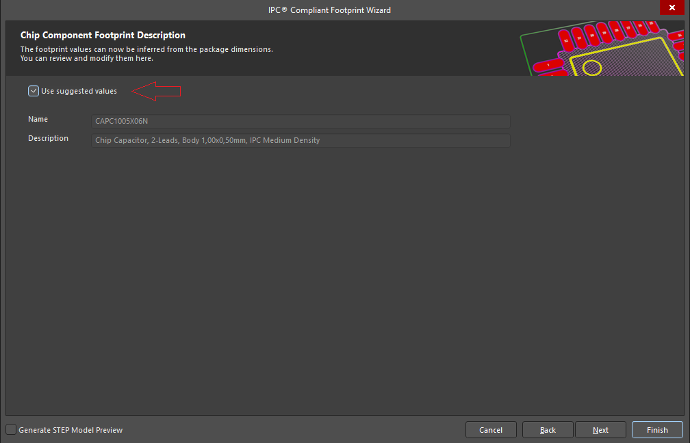

7. Далее нажимать _Next_, не меняя настроек, до появления следующего окна. Выбрать пункт _Current PcbLib File_, остальные оставить без изменений. Пройти далее и завершить создание компонента

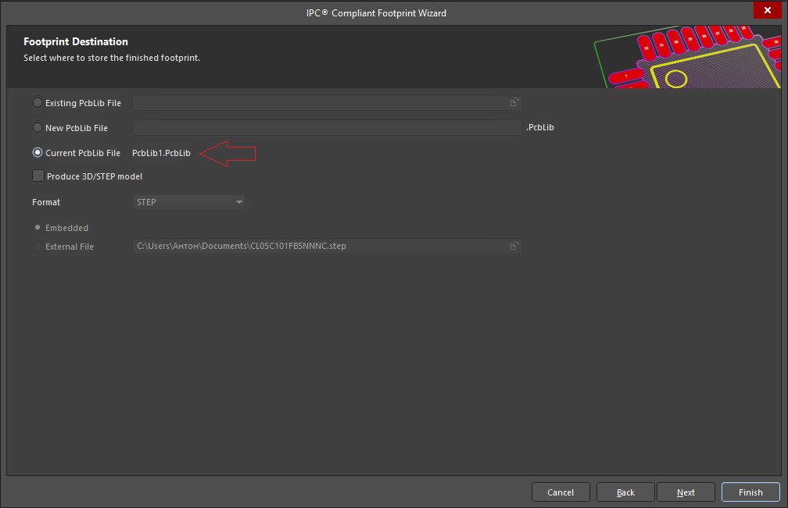

8. Добавить слои _Mechanical 7_ и _Mechanical 9_ для отображения полей _Comment_ и _Designator_ компонента, соответственно. Для этого горячей клавишей _L_ открыть окно _View Configuration_, далее _Layers -> Mechanical Layers -> Add Mechanical Layer_. Заполнить поля слоя - название _Layer Name_ и номер _Layer Number_ (например, _Mechanical 9_ и _9_)

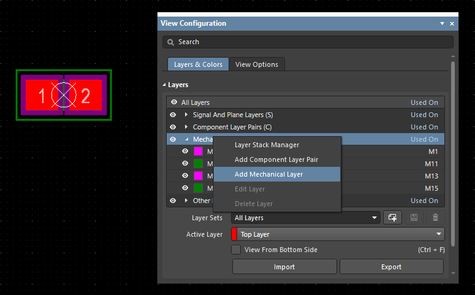

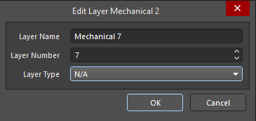

9. Внизу рабочего окна выбрать нужный слой и добавить с помощью _String_ надписи. На слой _Mechanical 7_ - _.Comment_, на слой  _Mechanical 9_ - _.Designator_ (точка обязательна). Открыть свойства, выбрав их и нажав _F11_, проверить шрифт и высоту текста. Должно быть _GOST MT_, _Bold_, высота текста 1,2 мм

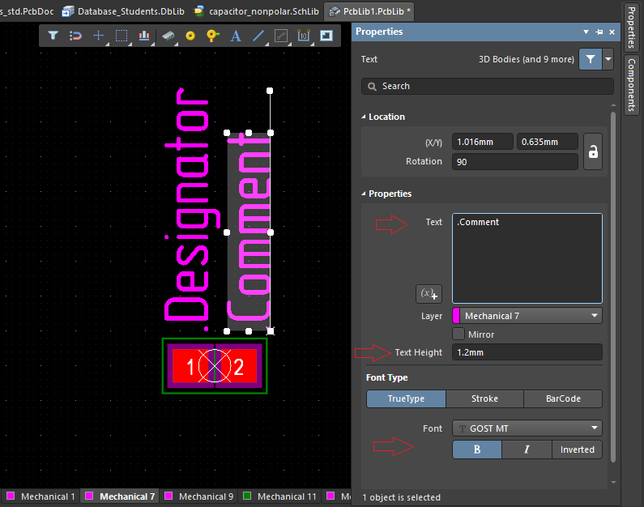

10. Сохранить файл с посадочным местом в папку _pcb_ библиотеки, называя его по аналогии с _Name_ посадочного места. Например, _C0402_ -> _с0402_

11. Готово! Компонент создан
